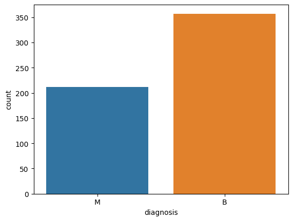
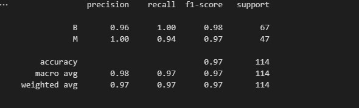

# Breast Cancer Detection App

The breast cancer detection app is a machine learning application that utilizes Scikit-learn to train a predictive model. The model is trained on a dataset of tabular data containing various features associated with breast cancer. The features are used to train the model to predict whether a given case is benign or malignant .The machine  application is designed to be user-friendly and accessible to healthcare professionals, allowing them to quickly and accurately diagnose breast cancer using this powerful predictive tool. It has a performance of  97% accuracy on a hold-out test set.


## Data Collection 
The  WISCONSIN Breast Cancer dataset is a widely used benchmark dataset for binary classification tasks. It contains information about breast cancer tumors, including attributes such as size, shape, and texture. There are a total of 569 instances in the dataset, with 212 malignant (M) and 357 benign (B) cases

[DOWNLOAD ON KAGGLE](https://www.kaggle.com/datasets/uciml/breast-cancer-wisconsin-data)

## Target Variable
The target contains 212 Malignant and 357 benign samples.



## Features
Here contains all the features that were used in training the model

#### radius_mean 
The mean distance from the center to points on the perimeter of the tumor.

#### perimeter_mean 
The perimeter (total length of the boundary) of the tumor.

#### area_mean 
The area enclosed by the perimeter of the tumor.

#### concavity_mean 
A measure of the severity of concave portions of the contour of the tumor.

#### concave points_mean 
The number of concave portions of the contour of the tumor.

#### radius_worst 
The largest distance from the center to points on the perimeter of the tumor.

#### perimeter_worst 
The largest perimeter (total length of the boundary) of the tumor.

#### area_worst 
The largest area enclosed by the perimeter of the tumor.

#### concavity_worst 
The largest measure of the severity of concave portions of the contour of the tumor.

#### concave points_worst 
The largest number of concave portions of the contour of the tumor.


## Training / Testing
The model was trained on 80% of the dataset, and was evaluated on the remaining 20% of the data.

## Evaluation 
The classification report shows the precision and recall scores on each of the labels and also  the f1-scores.




The confusion matrix shows the distribution of predictions and how well they got predicted. On the test set , we have no false positives and very little false negatives


## Testing the Application
You can test the flask application using pytest by running 
```console
pytest
```
in the root directory of the project

## Dependencies
* Python >= 3.7
* Flask >= 2.2.1
* Scikit-learn >= 1.2.1
